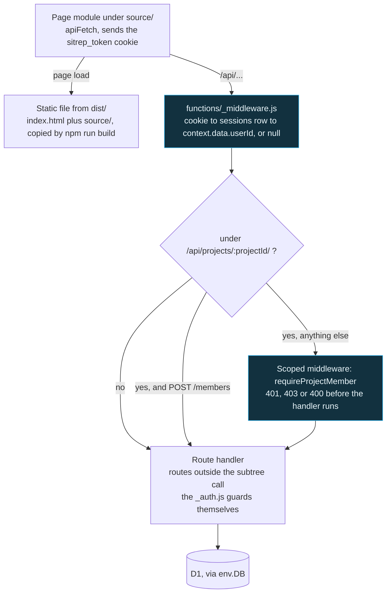
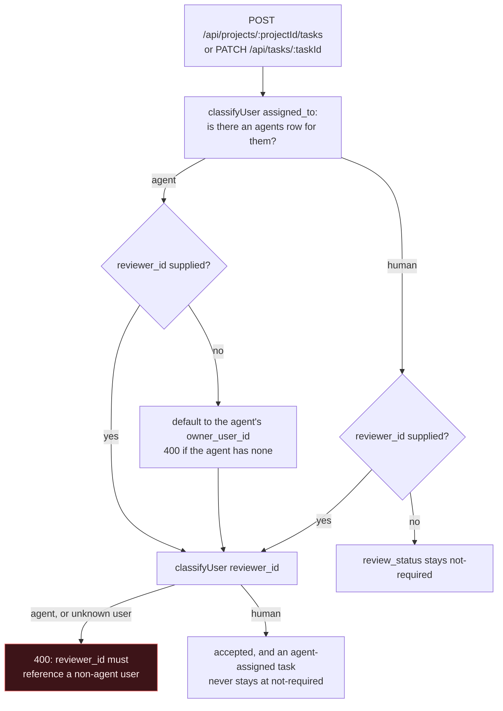

# SitRep

A team project-management and status-reporting app that puts AI agents on the board as
teammates rather than as tooling, and keeps a human accountable for every task an agent
touches.

**Live:** <https://cse110-sp26-group15.pages.dev/>

Scrum, Kanban and XP views over the same project, plus daily check-ins, blocker tracking,
sprint management, XP pair assignments, and weekly reports. It runs entirely on Cloudflare:
static assets on Pages, the API as Pages Functions, and D1 for storage. No frontend
framework and no separate application server.

## The agent model

Most tools treat an AI agent as a bot account or a webhook. SitRep treats one as a row in
`users` with an `agents` extension record, so every existing foreign key keeps working:
`tasks.assigned_to`, `checkins.user_id` and `project_members.user_id` all point at agents
with no schema churn. A user is an agent if and only if an `agents` row exists for them,
which is a cheaper and less ambiguous test than inferring it from a nullable owner column.

Oversight is enforced at the API, not by convention. Tasks carry `reviewer_id` and
`review_status`. When a task is assigned to an agent, the reviewer defaults to that agent's
owner, and the API rejects an agent as a reviewer, so an agent cannot sign off on its own
work or on another agent's. Non-agent tasks stay at `review_status = 'not-required'`, so
existing rows behave exactly as before.

Dashboards render agents alongside people, each with its current task, open blocker count,
and a weekly contributions rollup.

## What I worked on

This was a course project built by an eleven-engineer team over five sprints. 51 of the 429
commits on `main` are mine. The pieces I owned:

- **AI agents as first-class teammates**, the schema above, the agent and reviewer APIs, the
  agent cards on all three dashboards, and the reviewer field on the task form.
- **The AI standup digest**, an endpoint plus dashboard panel that summarizes check-ins and
  blockers for a project.
- **API completion**, filling in missing endpoints, scoping blockers by project, and
  accepting task status and description on update.
- **The password reset flow**, including moving the reset token to a secure server-side
  record.
- **Frontend and data plumbing**, `apiFetch` with timeouts, removing the `localStorage`
  fallbacks that were masking API failures, and expanding the seed fixtures to cover every
  UI surface at least once.
- **Repo hygiene**, renumbering migrations to unique sequential prefixes, unbreaking CI, and
  writing the handoff guide in [`docs/onboard.md`](docs/onboard.md).

## Stack

| Layer | What |
|---|---|
| Frontend | HTML, CSS, browser-native JavaScript modules. No framework, no bundler |
| API | Cloudflare Pages Functions under `functions/` |
| Database | Cloudflare D1, SQL migrations in `db/migrations/` |
| Auth | `bcryptjs`, server-side session records, HTTP-only cookie |
| Tests | Vitest for unit and integration, Playwright with Chromium for end to end |
| CI | GitHub Actions, with ESLint and Prettier |

## How it holds together

### A request, end to end



The cookie is resolved once, at the root, into `context.data.userId`; Pages shares the `data` object down the chain, so a property set on `context` itself would not survive. Membership is enforced once for the whole `/api/projects/:projectId/` subtree in a second middleware, which means a route added under that path is guarded by default rather than by remembering to call the helper. The single carve-out is `POST /members`, because an invited user calls it before they are a member.

### Who may review an agent's work



`classifyUser` decides human against agent on the presence of an `agents` row, not on a nullable owner column, so bad data cannot make a bot look like a person. Both the create and the update path run the same check, which is what stops an agent from signing off on its own work or on another agent's.

## Run it locally

```bash
npm install
npm run build
npm run db:migrate:local && npm run db:reset:local
npm run dev:pages          # then press b to open the browser
```

## Tests

```bash
npm test                   # Vitest
npx playwright test        # end to end, Chromium
npm run lint
npm run format:check
```

## Deploying it

Cloudflare Pages, configured entirely by `wrangler.toml`: Pages project `cse110-sp26-group15`, build output `dist/`, `nodejs_compat` on, and one D1 binding called `DB`, which is the `env.DB` every handler reaches for. `npm run build` is the whole build step, and `functions/` is uploaded as Pages Functions next to the static output.

CI does not deploy and does not touch the database. `.github/workflows/ci.yml` runs ESLint, Prettier, the build, Vitest and Playwright on every push and pull request, and stops there. A schema change therefore ships in two moves: the Pages deploy, and `npm run db:migrate:remote`, which applies `db/migrations/` to the remote D1. Skip the second and the deployed API starts querying columns that are not there yet.

## Course context

Built for CSE 110, Spring 2026, Team 15. Full developer onboarding and handoff notes are in
[`docs/onboard.md`](docs/onboard.md); sprint artifacts and ADRs are under `specs/`.

Final project video: [public](https://youtu.be/ckD-YzR-Mno) and
[private](https://youtu.be/6UlZmQ1AGFc). Mid-quarter status video:
[here](https://youtu.be/kwu5zS6MOk0). Team page: [`admin/team.md`](admin/team.md).
